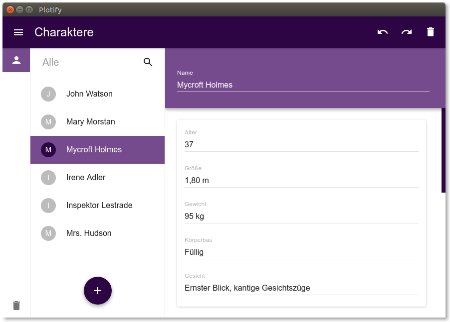

# Plotify

Plotify ist eine Software für Schriftsteller/innen, die dir dabei hilft,
die Charaktere deiner Geschichte zu planen und zu organisieren.
Behalte stets den Überblick und erschaffe eine fantastische Geschichte! :books:

**Hinweis: Plotify befindet sich noch in der ersten Entwicklungsphase.
Eine erste Testversion wird bald veröffentlicht.**



## Lizenz

Plotify ist eine freie Software. Jeder darf die Software kostenlos verwenden,
weiterverbreiten, deren Quelltext studieren, verändern und verbessern.
Plotify ist lizenziert unter der [GNU General Public License Version 3](LICENSE).
Erfahre mehr über die Bedeutung von [freier Software](https://www.gnu.org/philosophy/free-sw.de.html).


## Entwicklung

```bash
git clone https://github.com/SebastianSchmidt/plotify.git
cd plotify
npm install
npm run rebuild
npm start
```

Wichtig: Das Modul `electron-rebuild` verwendet das Modul `node-gyp`. Prüfen Sie,
ob alle notwendige Software für `node-gyp` installiert ist: [Preconditions for node-gyp](https://github.com/nodejs/node-gyp#installation)
