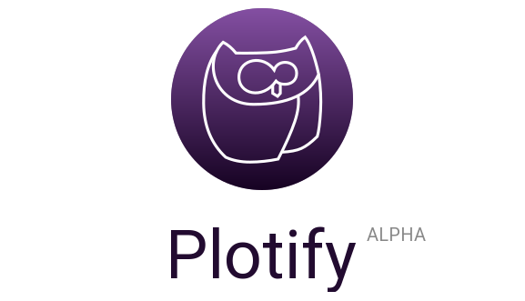

  

  <strong>
    Plotify ist eine Software für Schriftsteller/innen, die dir dabei hilft, die Charaktere deiner Geschichte zu planen und zu organisieren.
    Behalte stets den Überblick und erschaffe eine fantastische Geschichte!
  </strong>

  

## Download

**Achtung: Plotify befindet sich noch in einer sehr frühen Entwicklungsphase.**
**Es sollten keine Informationen ausschließlich in Plotify gespeichert werden.**

Lade dir Plotify kostenlos für dein Betriebssystem herunter:

<table>
    <tr>
        <td align="center" width="50%">
            
         </td>
        <td align="center" width="50%">
            
        </td>
    </tr>
    <tr>
        <td align="center">
            <a href="https://github.com/plotify/plotify/releases/download/v0.1.0/plotify-0.1.0-windows-x64.exe">
                <b>Windows</b> 
                Windows 7, 8, 10
            </a>
        </td>
        <td align="center">
            <a href="https://github.com/plotify/plotify/releases/download/v0.1.0/plotify-0.1.0-linux-amd64.deb">
                <b>Linux</b> 
                Ubuntu, Linux Mint, elementary OS
            </a>
        </td>
    </tr>
</table>

## Lizenz

Plotify ist eine freie Software. Jeder darf die Software kostenlos verwenden,
weiterverbreiten, deren Quelltext studieren, verändern und verbessern.
Plotify ist lizenziert unter der [GNU General Public License Version 3](LICENSE).

- [Erfahre mehr über die Bedeutung von freier Software.](https://www.gnu.org/philosophy/free-sw.de.html)
- [Erfahre, wie du den Quelltext von Plotify bearbeiten kannst.](docs/development/README.md)
