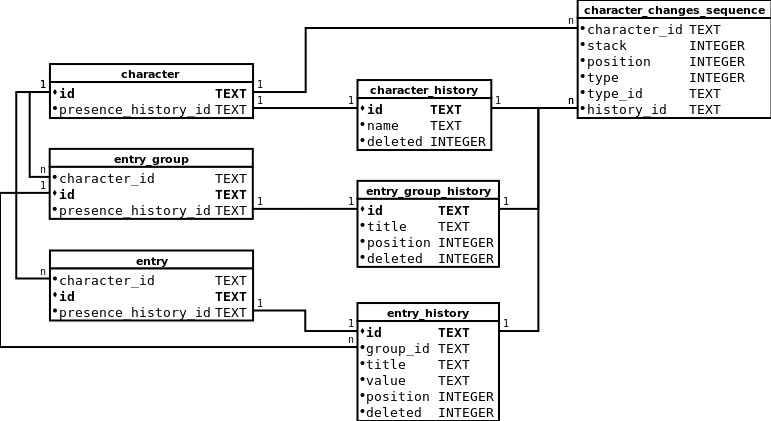

# Charaktere

Ein Charakter ist eine handelnde Person in einer Geschichte.


## Attribute

Jeder Charakter hat die folgenden Attribute:

| Name      | Datentyp | Beschreibung                                                     |
|-----------|----------|------------------------------------------------------------------|
| id        | String   | Ein eindeutiger Bezeichner für den Charakter in Form einer UUID. |
| name      | String   | Der Name des Charakters.                                         |
| deleted   | boolean  | Wurde der Charakter gelöscht?                                    |

Ein Charakter im JSON-Format könnte beispielsweise folgendermaßen aussehen:

```javascript
{
  id: "e926d949-a50b-489b-94be-7d63da9ac028",
  name: "Max Mustermann",
  deleted: false
}
```

Jedem Charakter ist ein Steckbrief zugeordnet, der aus einer Reihe von
gruppierten Key-Value-Paaren besteht. Jeder Steckbrief hat die folgenden
Attribute:

| Name        | Datentyp | Beschreibung                                                     |
|-------------|----------|------------------------------------------------------------------|
| characterId | String   | Die ID des Charakters, dem dieser Steckbrief zugeorndet ist.     |
| groups      | Group[]  | Ein Array mit den Gruppen des Steckbriefs.                       |

Jede Gruppe hat die folgenden Attribute:

| Name        | Datentyp | Beschreibung                                                     |
|-------------|----------|------------------------------------------------------------------|
| id          | String   | Die ID der Gruppe.                                               |
| title       | String   | Der Titel der Gruppe.                                            |
| entries     | Entry[]  | Ein Array mit den Einträgen in der Gruppe.                       |

Jeder Eintrag hat die folgenden Attribute:

| Name        | Datentyp | Beschreibung                                                     |
|-------------|----------|------------------------------------------------------------------|
| id          | String   | Die ID des Eintrags.                                             |
| title       | String   | Der Titel des Eintrags.                                          |
| value       | String   | Der Wert des Eintrags.                                           |

Ein Steckbrief im JSON-Format könnte beispielsweise folgendermaßen aussehen:

```javascript
{
  characterId: "e926d949-a50b-489b-94be-7d63da9ac028",
  groups: [
    {
      id: "d8bec6e8-1f4f-4b3e-b651-71e9a5bbeae4"
      title: "Äußere Merkmale",
      entries: [
        {
          id: "0a39ceab-71f2-42d5-9daf-be017e1e07f3"
          title: "Augenfarbe",
          value: "blau"
        },
        {
          id: "d2b2c642-5a05-4cf1-9793-26b0a7182d4c"
          title: "Haarfarbe",
          value: "schwarz"
        }
      ]
    },
    {
      id: "d7f899cb-241b-4eb7-8d9f-80be40e587f2"
      title: "Innere Merkmale",
      entries: [
        {
          id: "3112f49f-f6db-4a66-b73c-e2b0a88ba60c"
          title: "Interessen",
          value: "Beispiel sein"
        },
        {
          id: "26c3d90c-d0f5-49ff-81a8-ad2af62e484e"
          title: "Moralvorstellungen",
          value: ""
        }
      ]
    }
  ]
}
```


## Tabellen in SQLite

Charaktere und deren Steckbriefe werden in den folgenden Tabellen in einer
SQLite-Datenbank abgelegt.



- Alle Texte werden in der Zeichenkodierung UTF-8 gespeichert.
- Die IDs sind die 16 Bytes einer UUID.
- Die Spalte `queue` der Tabelle `character_changes_sequence` kann die folgenden
  Werte enthalten: 0 = past, 1 = future.
- Die Spalte `type` der Tabelle `character_changes_sequence` kann die folgenden
  Werte enthalten: 0 = character, 1 = entry_group, 2 = entry.

```sql
CREATE TABLE `character` (
  `id`                  TEXT NOT NULL,
  `presence_history_id` TEXT NOT NULL,
  PRIMARY KEY(id),
  FOREIGN KEY(`presence_history_id`) REFERENCES character_history(id)
);

CREATE TABLE `character_history` (
  `id`      TEXT    NOT NULL,
  `name`    TEXT    NOT NULL,
  `deleted` INTEGER NOT NULL DEFAULT 0 CHECK(deleted = 0 OR deleted = 1),
  PRIMARY KEY(id)
);

CREATE TABLE `character_changes_sequence` (
  `character_id` TEXT    NOT NULL,
  `queue`        INTEGER NOT NULL CHECK(queue = 0 OR queue = 1),
  `position`     INTEGER NOT NULL CHECK(position >= 0),
  `type`         INTEGER NOT NULL CHECK(type = 0 OR type = 1 OR type = 2),
  `history_id`   TEXT NOT NULL,
  FOREIGN KEY(`character_id`) REFERENCES character(id)
);

CREATE TABLE `entry_group` (
  `character_id`        TEXT NOT NULL,
  `id`                  TEXT NOT NULL,
  `presence_history_id` TEXT NOT NULL,
  PRIMARY KEY(id),
  FOREIGN KEY(`character_id`)        REFERENCES character(id),
  FOREIGN KEY(`presence_history_id`) REFERENCES entry_group_history(id)
);

CREATE TABLE `entry_group_history` (
  `id`       TEXT    NOT NULL,
  `title`    TEXT    NOT NULL,
  `position` INTEGER NOT NULL           CHECK(position >= 0),
  `deleted`  INTEGER NOT NULL DEFAULT 0 CHECK(deleted = 0 OR deleted = 1),
  PRIMARY KEY(id)
);

CREATE TABLE `entry` (
  `group_id`            TEXT NOT NULL,
  `id`                  TEXT NOT NULL,
  `presence_history_id` TEXT NOT NULL,
  PRIMARY KEY(id),
  FOREIGN KEY(`group_id`)            REFERENCES entry_group(id),
  FOREIGN KEY(`presence_history_id`) REFERENCES entry_history(id)
);

CREATE TABLE `entry_history` (
  `id`       TEXT    NOT NULL,
  `title`    TEXT    NOT NULL,
  `value`    TEXT    NOT NULL DEFAULT '',
  `position` INTEGER NOT NULL            CHECK(position >= 0),
  `deleted`  INTEGER NOT NULL DEFAULT 0  CHECK(deleted = 0 OR deleted = 1),
  PRIMARY KEY(id)
);
```
