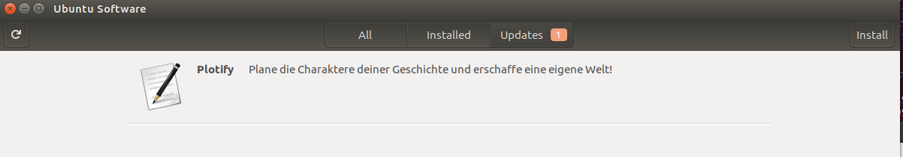

# Release Anleitung
## windows

```java
// Erstelle Installer
npm run distribution:windows

// Kopiere Dateien auf alpha-Server z.B. via sftp
open alpha@suhail.uberspace.de
put <localfolder>\plotify-<version>-delta.nupgkg
put <localfolder>\plotify-<version>-full.nupgkg
put <localfolder>\PlotifySetup.exe
put <localfolder>\RELEASES

// Verschiebe Dateien auf dem alpha-Server ins release-Verzeichnis
mv <localfolder>\plotify-<version>-delta.nupgkg html/releases/plotify
mv <localfolder>\plotify-<version>-full.nupgkg html/releases/plotify
mv <localfolder>\PlotifySetup.exe html/releases/plotify
mv <localfolder>\RELEASES html/releases/plotify
```

## linux

```java
// Erstelle Installer
npm run distribution:linux

// Kopiere Installer auf alpha-Server (zur Zeit Jaspers V-Server)
scp <localfolder>/plotify-<version>.deb <user>@82.165.163.78:<newfilename>

// Mit dem Server verbinden.

// In das Repository-Verzeichnis navigiere
cd /var/www/[...]/alpha/repos/debian/

// Repository auf dem Server aktualisieren aktualisieren.
// zZt. ist nur ein Repository für <osrelease> xenial angelegt.
reprepo includedeb <osrelease> <newfilename>

```




Auf dem Client muss aktuell noch manuell der Key und das Repo eingetragen werden.
Folgendes Skript muss daher noch bei Installation ausgeliefert und ausgeführt werden.

```sh
#!/bin/sh

# get sources and key files
wget http://82.165.163.78/alpha/repos/debian/alpha-plotify-sources.list
wget http://82.165.163.78/alpha/repos/debian/alpha_repo.gpg.key

# install key and move sources
sudo cp alpha-plotify-sources.list /etc/apt/sources.list.d/
sudo apt-key add alpha_repo.gpg.key

# clean up
rm alpha-plotify-sources.list
rm alpha_repo.gpg.key
```
