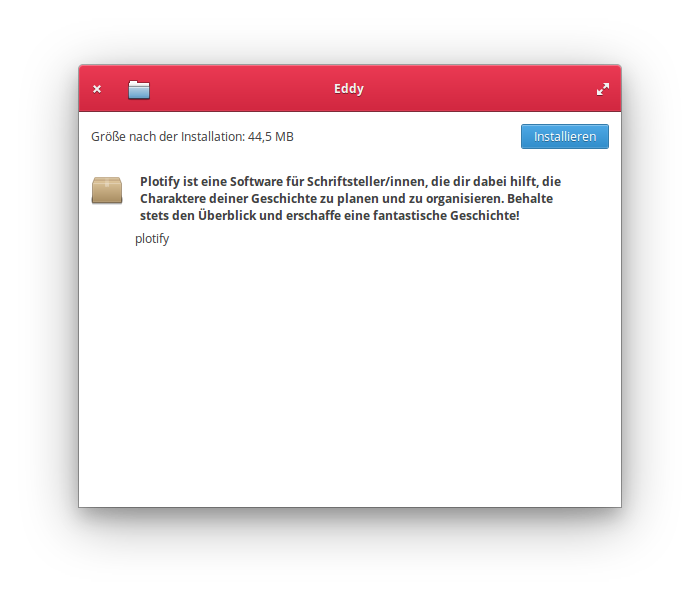
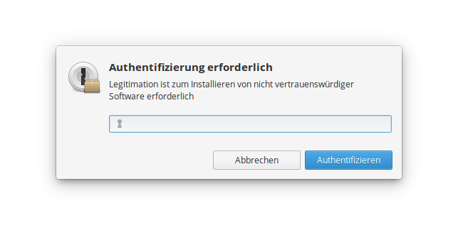
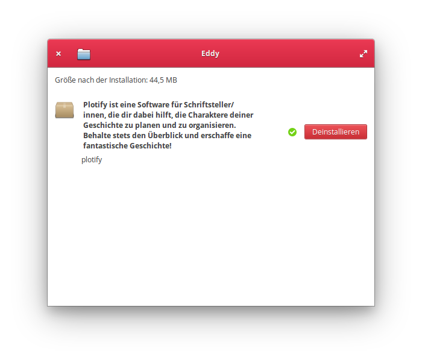
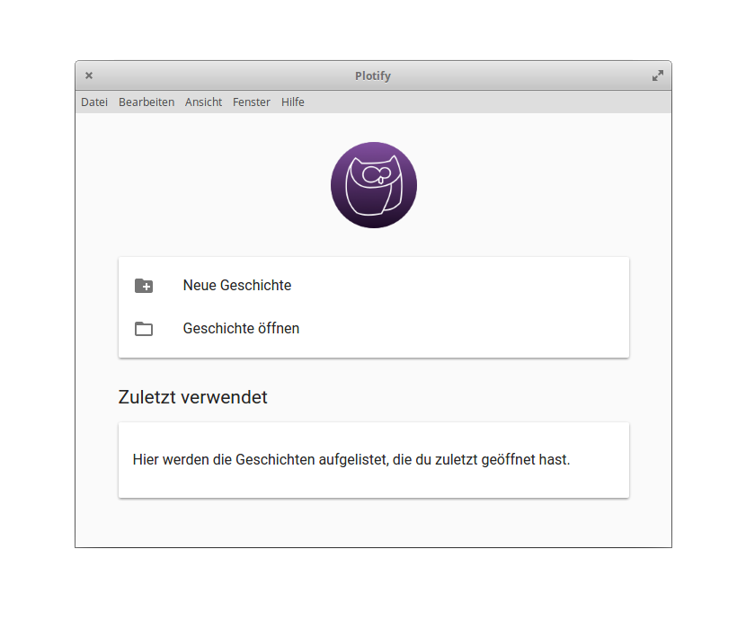

# Installation von Plotify unter elementary OS

1. [Installiere Eddy](install-eddy.md), um Plotify unter elementary OS installieren zu können.
2. Lade die neuste Version von Plotify herunter: [Plotify für elementary OS](https://github.com/plotify/plotify/releases/download/v0.2.0-alpha.5/plotify-0.2.0-alpha.5-linux-amd64.deb)
3. Öffne die heruntergeladene Datei mit der Endung `.deb` mit einem Doppelklick oder über das Kontextmenü im Eddy-Installationsprogramm. 
4. Klicke in dem sich öffnenden Fenster auf den Button "Installieren", um die Installation von Plotify zu starten. 
5. Gebe dein Benutzerpasswort in dem sich öffnenden Dialog-Fenster ein, um die Installation von Plotify zu autorisieren. 
6. Im Fenster von Eddy wird der Installationsfortschritt von Plotify angezeigt.
   Nachdem die Installation abgeschlossen wurde, kannst du Eddy schließen. 
   
7. Du kannst Plotify nun über das Anwendungsmenü starten! :tada: 
