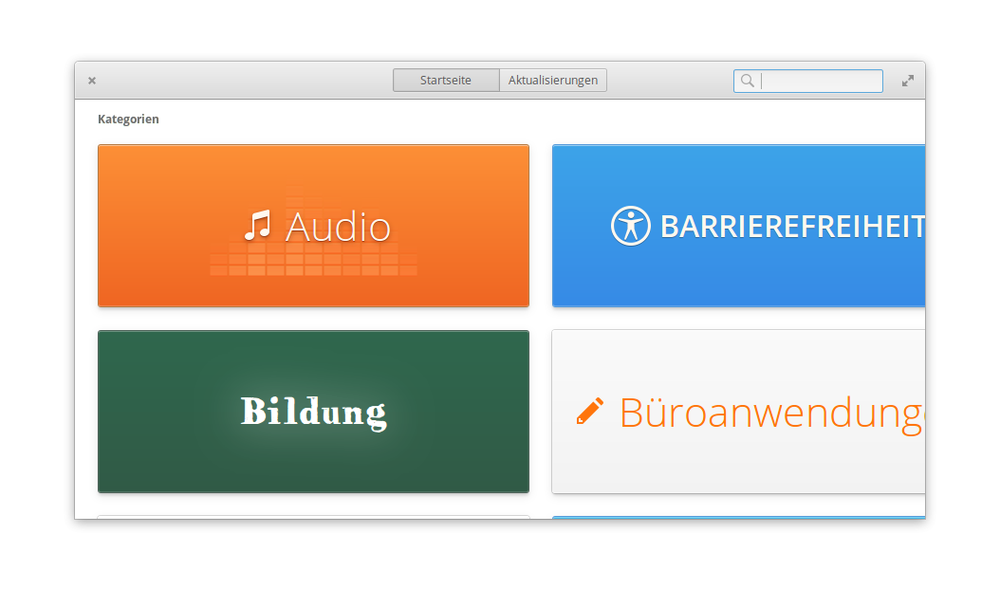
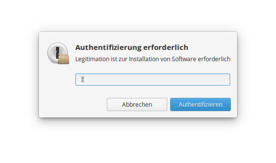

# Installation von Eddy unter elementary OS

[Eddy](https://github.com/donadigo/eddy) ist eine Anwendung, mit der du `.deb`-Dateien unter elementary OS installieren kannst.
Wenn du bereits eine andere Anwendung zum Installieren von `.deb`-Dateien installiert hast, musst du Eddy nicht installieren.
In der Installationsanleitung von Plotify wird davon ausgegangen, dass du Eddy installiert hast.

1. Öffne das App Center über das Anwendungsmenü und gebe den Suchbegriff **eddy** in das Suchfeld oben rechts im Fenster des App Centers ein. 
2. Klicke auf den Button "Kostenlos", um Eddy zu installieren. 
3. Gebe dein Benutzerpasswort in dem sich öffnenden Dialog-Fenster ein, um die Installation von Eddy zu autorisieren. 
4. Im Fenster des App Centers wird der Installationsfortschritt von Eddy angezeigt.
   Nachdem die Installation abgeschlossen wurde, kannst du das App Center schließen.
   Du kannst nun `.deb`-Dateien über Eddy installieren.
