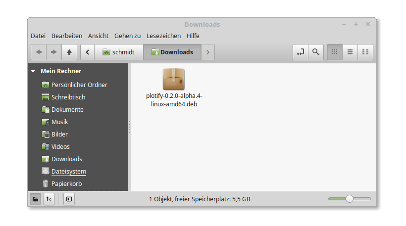
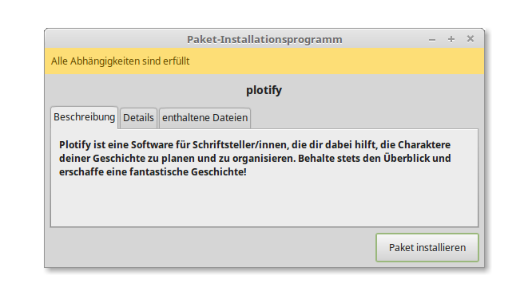
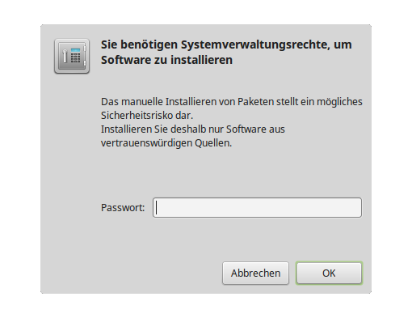
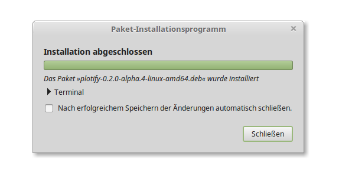
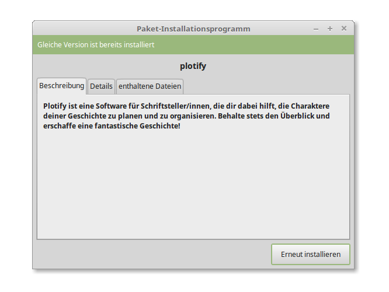
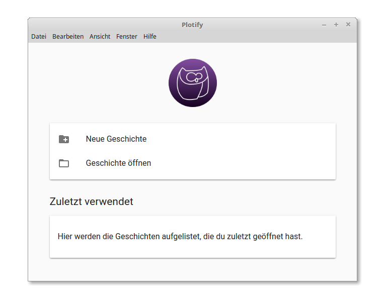

# Installation von Plotify unter Linux Mint

1. Lade die neuste Version von Plotify herunter: [Plotify für Linux Mint](https://github.com/plotify/plotify/releases/download/v0.2.0-alpha.7/plotify-0.2.0-alpha.7-linux-amd64.deb)
2. Öffne die heruntergeladene Datei mit der Endung `.deb` mit einem Doppelklick oder über das Kontextmenü im GDebi-Paket-Installationsprogramm. 
3. Klicke in dem sich öffnenden Fenster auf den Button "Paket installieren", um die Installation von Plotify zu starten. 
4. Gebe dein Benutzerpasswort in dem sich öffnenden Dialog-Fenster ein, um die Installation von Plotify zu autorisieren. 
5. Es öffnet sich ein neues Dialog-Fenster, in dem der Fortschritt der Installation angezeigt wird. Klicke auf den Button "Schließen", sobald die Installation abgeschlossen wurde. 
6. In dem Fenster des Installationsprogramm wird angezeigt, dass Plotify installiert ist. Schließe das Fenster über das X oben rechts. 
7. Du kannst Plotify nun über das Startmenü starten! :tada: 
