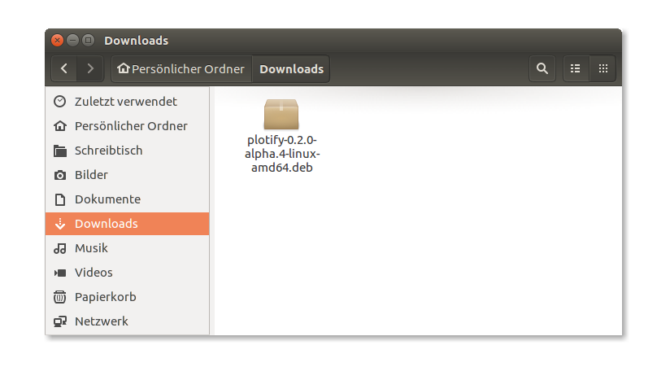
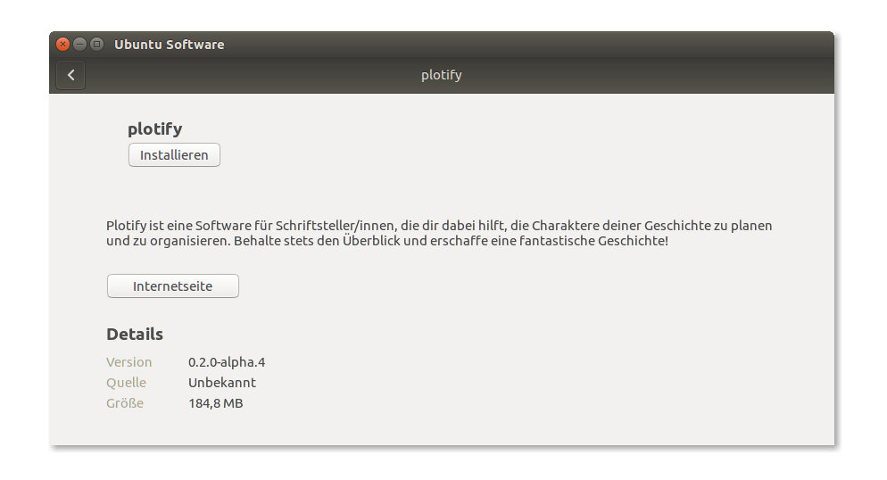

# Installation von Plotify unter Ubuntu

1. Lade die neuste Version von Plotify herunter: [Plotify für Ubuntu](https://github.com/plotify/plotify/releases/download/v0.2.0-alpha.5/plotify-0.2.0-alpha.5-linux-amd64.deb)
2. Öffne die heruntergeladene Datei mit der Endung `.deb` mit einem Doppelklick oder über das Kontextmenü im Software Center. 
3. Klicke in dem sich öffnenden Fenster auf den Button "Installieren", um die Installation von Plotify zu starten. 
4. Gebe dein Benutzerpasswort in dem sich öffnenden Dialog-Fenster ein, um die Installation von Plotify zu autorisieren. 
5. Der Fortschritt der Installation wird im Fenster des Software Centers angezeigt.
   Schließe das Fenster, sobald die Installation abgeschlossen wurde.
    
   
6. Du kannst Plotify nun über das Startmenü starten! :tada: 
