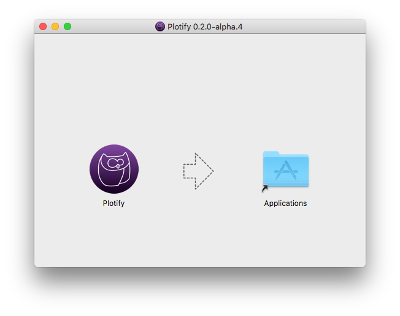
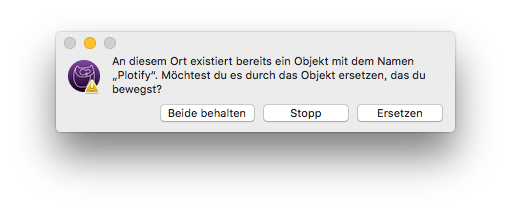
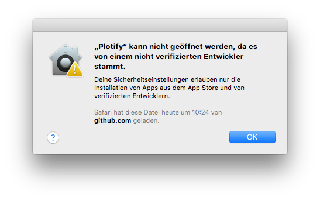
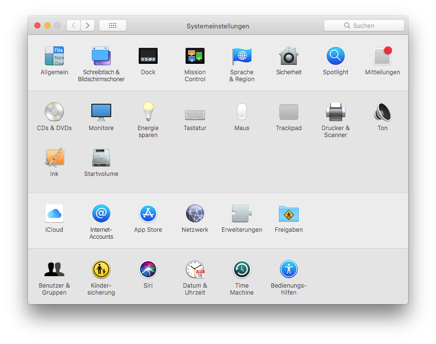
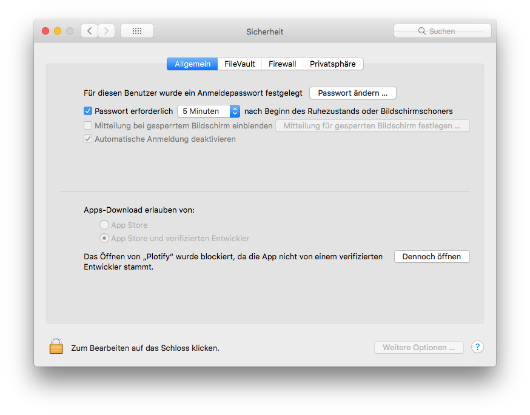
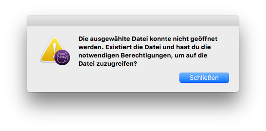
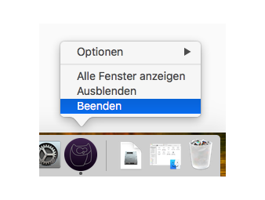
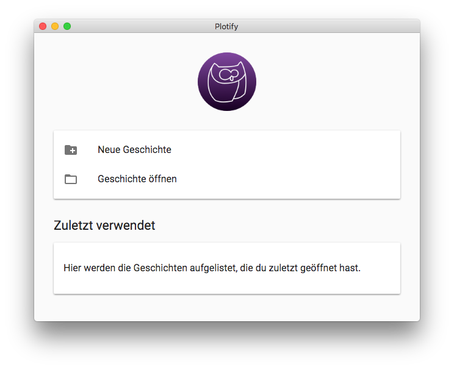

# Installation von Plotify unter macOS

Plotify befindet sich noch in einer frühen Entwicklungsphase.
Aus diesem Grund ist das Installationsprogramm von Plotify noch nicht mit einem Zertifikat signiert.
Das führt dazu, dass bei der Installation von Plotify Fehlermeldungen erscheinen.
Über einen kleinen Umweg kann Plotify dennoch installiert werden.

1. Lade die neuste Version von Plotify herunter: [Plotify für macOS](https://github.com/plotify/plotify/releases/download/v0.2.0-alpha.4/plotify-0.2.0-alpha.4-macos-x64.dmg)
2. Öffne die heruntergeladene Datei mit der Endung `.dmg` mit einem Doppelklick oder über das Kontextmenü. 
3. Es öffnet sich ein Fenster, in dem das Logo von Plotify angezeigt wird. Ziehe das Logo von Plotify mit der Maus auf das Order-Symbol rechts daneben. 
4. Wenn du Plotify bereits installiert hast, wird ein Dialog-Fenster angezeigt.
   Klicke auf den Button "Ersetzen", um die alte Version von Plotify durch die neue Version zu ersetzen. 
   
5. Es wird ein Kopiervorgang angezeigt. Nachdem der Kopiervorgang abgeschlossen wurde, kannst du das Fenster wieder schließen.
6. Plotify wird jetzt im Launchpad angezeigt. Wenn du jetzt versuchst Plotify zu starten erscheint eine Fehlermeldung, weil Plotify aktuell noch nicht mit einem Zertifikat signiert ist. 
7. Um Plotify dennoch starten zu können, öffne die Systemeinstellungen und dort die Sicherheitseinstellungen: 
8. Wenn du zuvor versucht hast, Plotify zu starten, kannst du in den Sicherheitseinstellungen auf den Button "Dennoch öffnen" klicken, um Plotify trotzdem zu starten. 
9. Es öffnet sich ein Dialog-Fenster, das dich fragt, ob du Plotify wirklich öffnen möchtest. Klicke auf den Button "Öffnen". 
10. Beim ersten Starten von Plotify erscheint der Ladebildschirm und kurz darauf die folgende Fehlermeldung. Schließe die Fehlermeldung über den Button "Schließen". 
11. Beende Plotify über das Dock oder das Anwendungsmenü.  
12. Ab jetzt kannst du Plotify ohne Fehlermeldung starten! :tada: 
