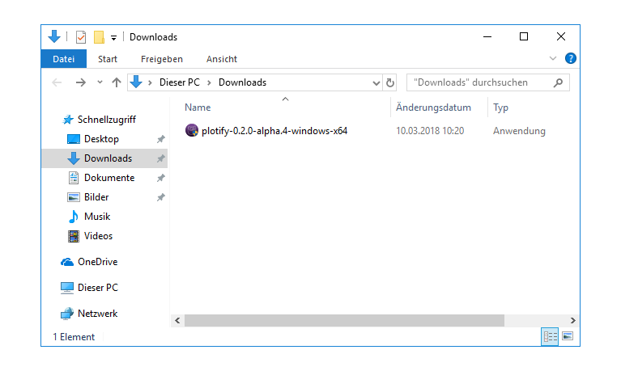
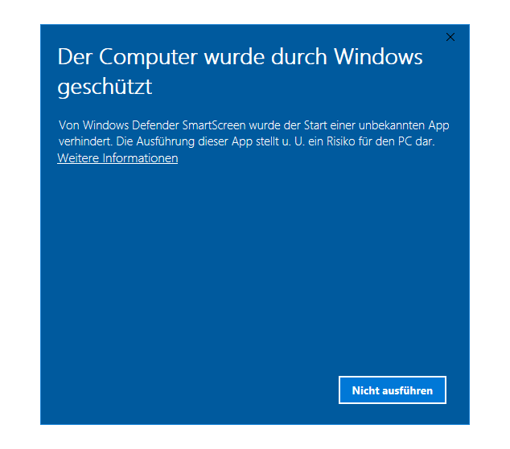
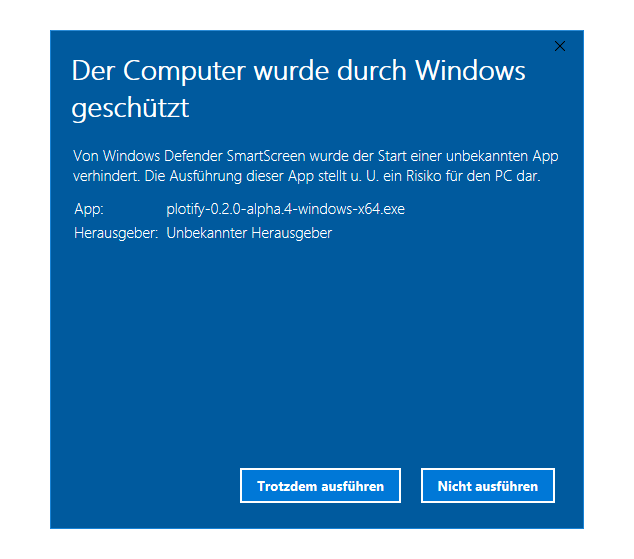

# Installation von Plotify unter Windows 10

1. Wenn du aktuell Plotify 0.1 installiert hast, musst du [Plotify 0.1 zunächst deinstallieren](uninstall.md), bevor du eine neue Version von Plotify installieren kannst.
2. Lade die neuste Version von Plotify herunter: [Plotify für Windows](https://github.com/plotify/plotify/releases/download/v0.2.0-alpha.5/plotify-0.2.0-alpha.5-windows-x64.exe)
3. Öffne die heruntergeladene Datei mit einem Doppelklick oder über das Kontextmenü. 
4. Weil Plotify aktuell noch nicht mit einem Zertifikat signiert ist, verhindert der Windows SmartScreen die Installation von Plotify.
   Klicke auf den Schriftzug "Weitere Informationen", um Plotify dennoch zu installieren. 
   
5. Klicke nun auf den Button "Trotzdem ausführen", um die Installation von Plotify zu erlauben. 
6. Klicke in dem sich öffnenden Dialog-Fenster auf den Button "Ja", um die Installation von Plotify zu starten. 
7. Nachdem die Installation abgeschlossen wurde, startet Plotify automatisch! :tada: 

