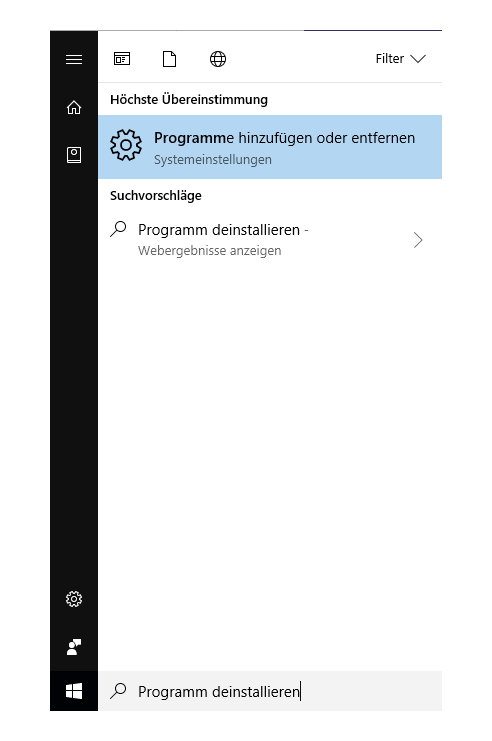
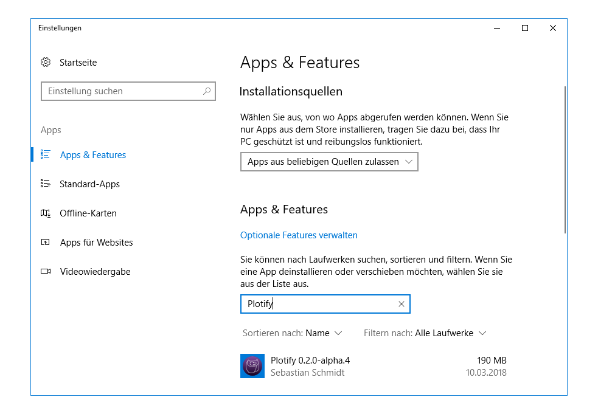
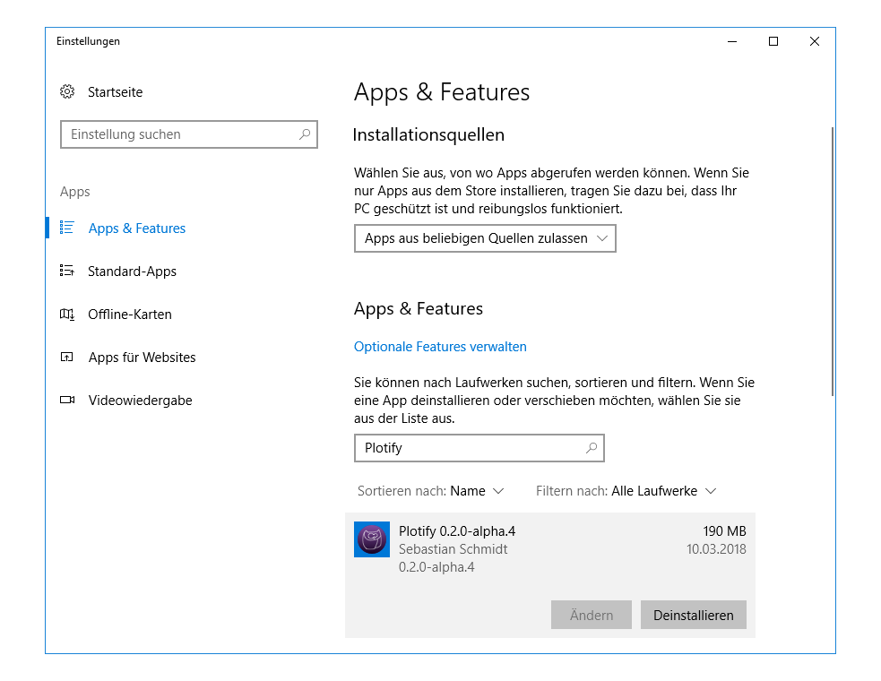
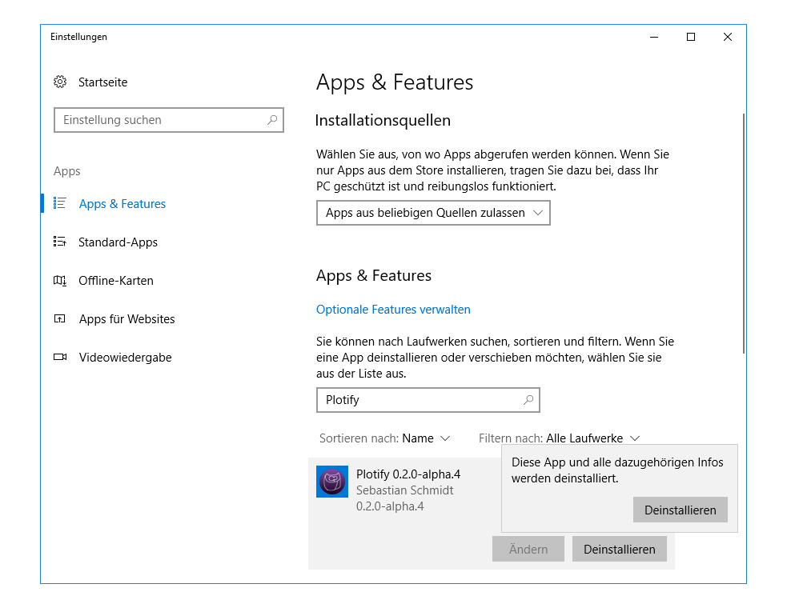
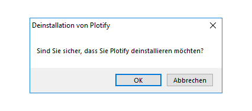

# Deinstallation von Plotify unter Windows 10

1. Öffne das Startmenü und suche nach "Programm deinstallieren".
   Klicke auf den Eintrag "Programme hinzufügen oder entfernen". 
   
2. Suche in dem sich öffnenden Fenster unter "Apps & Features" nach Plotify. 
3. Klicke auf den Eintrag von Plotify.
   Klicke dann auf den Button "Deinstallieren", der eingeblendet wurde. 
   
4. Bestätige, dass du Plotify deinstallieren möchtest, indem du auf den Button "Deinstallieren" in dem sich öffnenden Popup klickst. 
5. Klicke in dem sich öffnenden Dialog-Fenster auf den Button "Ja", um die Deinstallation von Plotify zu erlauben. 
6. Klicke in dem sich öffnenden Dialog-Fenster auf den Button "OK", um die Deinstallation von Plotify zu starten. 