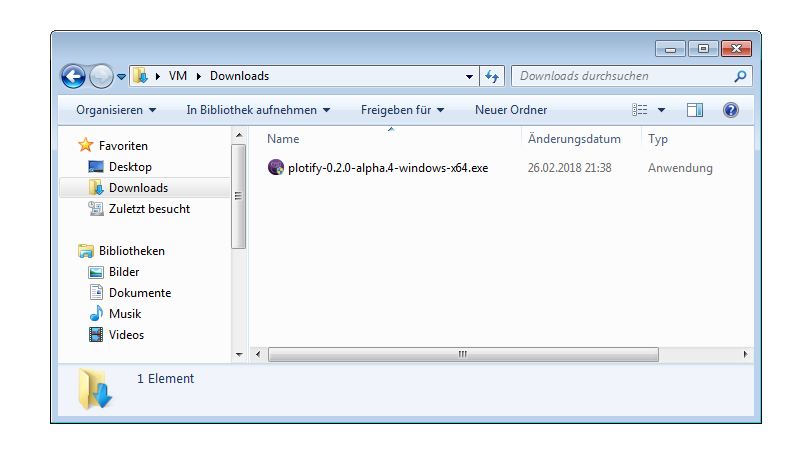
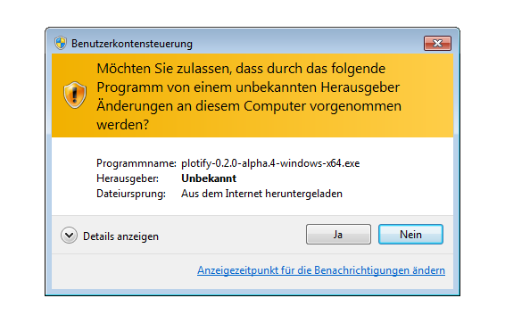
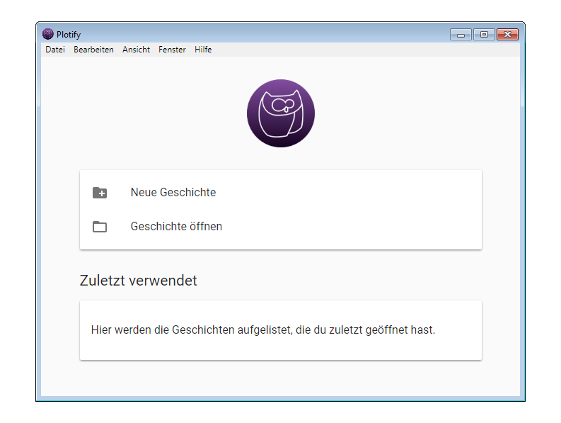

# Installation von Plotify unter Windows 7

1. Wenn du aktuell Plotify 0.1 installiert hast, musst du [Plotify 0.1 zunächst deinstallieren](uninstall.md), bevor du eine neue Version von Plotify installieren kannst.
2. Lade die neuste Version von Plotify herunter: [Plotify für Windows](https://github.com/plotify/plotify/releases/download/v0.2.0-alpha.4/plotify-0.2.0-alpha.4-windows-x64.exe)
3. Öffne die heruntergeladene Datei mit der Endung `.exe` mit einem Doppelklick oder über das Kontextmenü. 
4. Klicke in dem sich öffnenden Dialog-Fenster auf den Button "Ja", um die Installation von Plotify zu starten. 
5. Nachdem die Installation abgeschlossen wurde, startet Plotify automatisch! :tada: 
