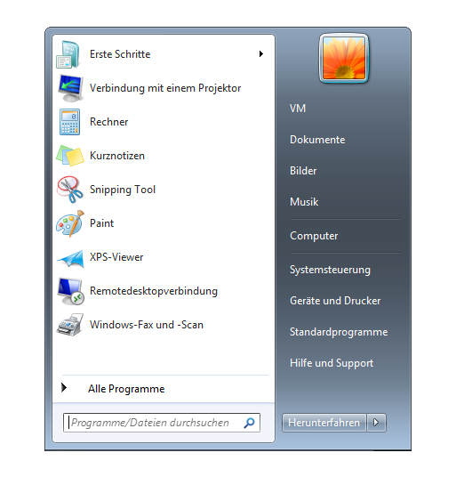
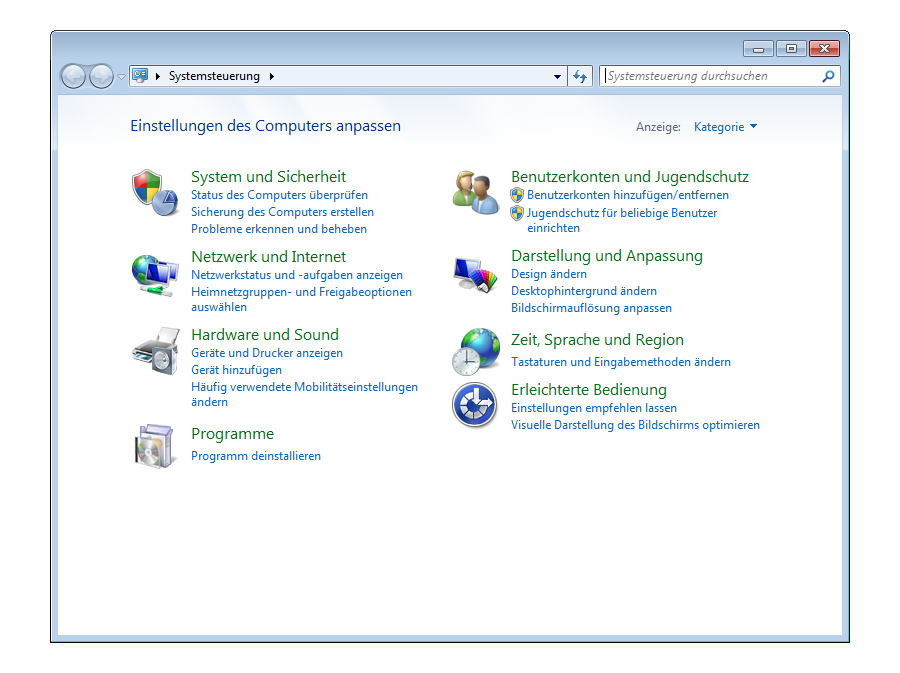
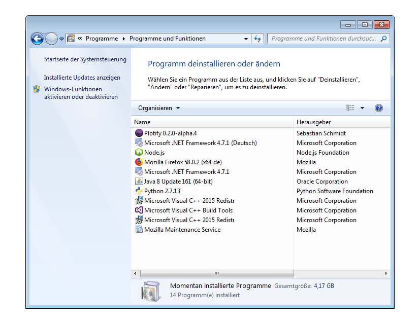
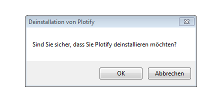

# Deinstallation von Plotify unter Windows 7

1. Öffne die Systemsteuerung über das Startmenü. 
2. Klicke auf "Programm deinstallieren" in der Systemsteuerung. 
3. Klicke mit der rechten Maustaste auf den Eintrag von Plotify und klicke in dem sich öffnenden Kontextmenü auf "Deinstallieren". 
4. Klicke in dem sich öffnenden Dialog-Fenster auf den Button "OK", um Plotify zu deinstallieren. 
