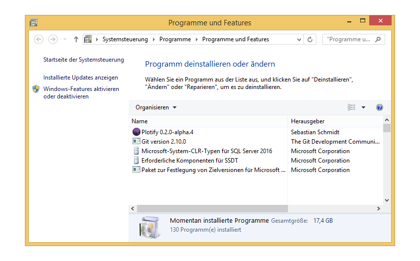
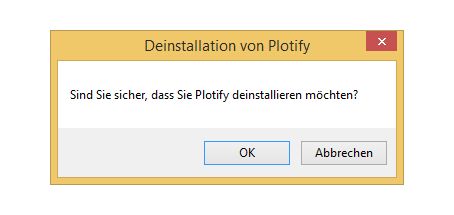

# Deinstallation von Plotify unter Windows 8

1. Öffne das Startmenü und suche nach "Programm deinstallieren".
   Klicke auf den Eintrag "Programm deinstallieren". 
   
2. Klicke mit der rechten Maustaste auf den Eintrag von Plotify und klicke in dem sich öffnenden Kontextmenü auf "Deinstallieren". 
3. Klicke in dem sich öffnenden Dialog-Fenster auf den Button "OK", um Plotify zu deinstallieren. 
